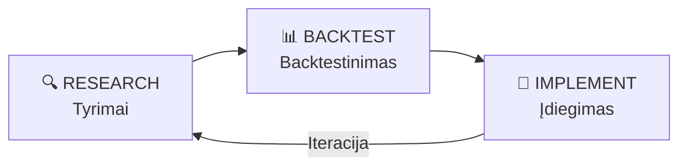
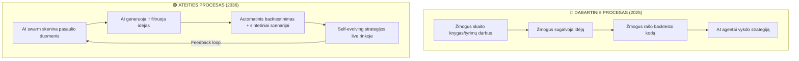

# 🌎 Moon Dev Roadmap — Pilna Analizė

## 📌 Kas yra moondev.com/roadmap?

**Moon Dev** (YouTube: [@MoonDevOnYT](https://youtube.com/moondevonyt)) — tai algoritminio prekybos mokytojas ir kūrėjas, kuris per **4+ metus** mokė žmones kurti quant trading sistemas. Nuo 2025 m. jis koncentruojasi į **AI agentų** integravimą į prekybą.

Puslapis `moondev.com/roadmap` yra **nemokamas algoritminio prekybos kelrodis** (roadmap), su šūkiu:

> *"A true leader will only bring the troops to battle if he knows they will win."* — Sun Tzu

---

## 🗂️ Viešos Roadmap Sekcijos

| Sekcija | Aprašymas |
|---|---|
| 🚙 **Trade Bot Roadmap** | "where do i start?" — pradžios taškas |
| 🍻 **Discord Community** | Bendruomenė — "join the fam" |
| 🙋 **FAQ** | Dažnai užduodami klausimai |
| 🧪 **RBI System 4 Algo Trading** | ⭐ Pagrindinė metodologija — "the secret sauce" |
| 🔥 **Alpha Generation & Strategies** | Idėjų generavimas — "edge ideas" |
| 📘 **Book List** | Rekomenduojamos knygos |
| 🤖 **Moon Dev AI Agents** | AI agentų automatizacija — "automation magic" |
| 📈 **Crypto Data** | Duomenų šaltiniai |
| ⭐ **Reviews & Testimonials** | Atsiliepimai |

> [!IMPORTANT]
> Detalus turinys kiekvienoje sekcijoje yra **užrakintas** — reikia Moon Dev API rakto arba **Quant Elite** narystės.

---

## 🧪 RBI Sistema — „The Secret Sauce"

Moon Dev'o pagrindinė strategijų kūrimo metodologija vadinama **RBI**:

### 1. 🔍 Research (Tyrimai) — „How to Find Great Ideas"

Tai yra **idėjų paieškos** fazė. Remiantis viešai prieinamais Moon Dev šaltiniais:

- **Alpha Generation & Strategies** — tai sekcija, kur pateikiamos "edge ideas" (pranašumo idėjos)
- **Duomenų šaltiniai** — OI (Open Interest), Liquidations, Funding Rates, Sentiment, Whale Activity
- **Akademiniai šaltiniai** — rekomenduojamų knygų sąrašas
- **Rinkos duomenų analizė** — CoinGecko, Twitter sentimentas, copy trader portfeliai
- **Bendruomenės idėjos** — Discord kanalas kaip idėjų šaltinis

**Idėjų paieškos principai:**
- Ieškoti rinkos neefektyvumų (market inefficiencies)
- Analizuoti sentiment / whale judėjimus
- Stebėti funding rates, open interest anomalijas
- Skaityti mokslinius darbus ir knygas
- Testuoti hipotezes su realiais duomenimis

### 2. 📊 Backtest (Backtestinimas)

- Kiekviena idėja **privalo** būti ištestuota su istoriniais duomenimis
- Moon Dev pabrėžia: *"Before running ANY trading algorithm with real money, you MUST backtest your strategies"*
- Backtesting rodo, kaip strategija būtų veikusi praeityje

### 3. 🚀 Implement (Įdiegimas)

- Strategija programuojama kaip trading bot
- Naudojami AI agentai automatizacijai
- Risk Agent kontroliuoja riziką
- Strategy Agent valdo strategijų vykdymą

---

## 🤖 AI Agentų Ekosistema (dabartinė situacija — 2025/2026)

Moon Dev's sukūrė **7 veikiančius AI agentų**:

| Agentas | Funkcija |
|---|---|
| **Trading Agent** | Analizuoja token duomenis per LLM, priima prekybos sprendimus |
| **Strategy Agent** | Valdo ir vykdo strategijas iš `strategies/` folderio |
| **Risk Agent** | Stebi portfelio riziką, PnL limitus, minimalų balansą |
| **Copy Agent** | Seka copy trading botų veiklą |
| **Whale Agent** | Stebi banginių (whale) aktyvumą |
| **Sentiment Agent** | Analizuoja Twitter sentimentą su garsinėmis pranešimais |
| **Focus Agent** | Tikrina fokusą kodavimo sesijų metu (produktyvumo įrankis) |

### Vizija ir Hipotezė

> *"AI agents will be able to build a better quant portfolio than humans."*

- **4 metai** mokant žmones quant sistemų
- **2025** — metai, kai AI agentai daro tą patį vietoj žmonių
- **2026** — planuojamas mokslinis darbas (paper) lyginant AI vs žmones

---

## 🔮 10 Metų Ateities Vizija: Kaip Patobulinti „Finding Great Ideas" Procesu

### Fazė 1: 2026–2028 — AI-Augmented Research

| Tobulinimas | Aprašymas |
|---|---|
| **Autonominiai Research Agentai** | AI agentai, kurie savarankiškai skaito naujus akademinius darbus, analizuoja alpha signalus ir pasiūlo naujas strategijas |
| **Multi-Source Sentiment Fusion** | Ne tik Twitter — Reddit, Discord, Telegram, YouTube komentarai, naujienos — viskas sujungta į vieną sentiment signalą |
| **Real-time Anomaly Detection** | ML modeliai, kurie automatiškai aptinka neįprastus rinkos judėjimus (OI spikes, funding rate anomalijas) ir siūlo tyrimų kryptis |
| **NLP Academic Paper Scanning** | Automatinis naujų mokslinių darbų skenavimas (arXiv, SSRN) ieškant potencialių alpha šaltinių |

### Fazė 2: 2028–2030 — Fully Autonomous Idea Generation

| Tobulinimas | Aprašymas |
|---|---|
| **Generative Strategy AI** | AI, kuris ne tik ieško idėjų, bet pats **generuoja** naujas strategijų hipotezes ir jas testuoja |
| **Cross-Asset Alpha Transfer** | Strategijos, veikiančios vienoje rinkoje (pvz., crypto), automatiškai adaptuojamos kitoms (Forex, akcijos) |
| **Reinforcement Learning for Idea Quality** | RL modelis, kuris mokosi iš praeities — kurios idėjos virto pelningomis strategijomis ir kodėl |
| **Collaborative AI Swarm** | Keli agentai „diskutuoja" tarpusavyje — vienas siūlo idėją, kitas ją kritikuoja, trečias backtestina |

### Fazė 3: 2030–2033 — Predictive Market Intelligence

| Tobulinimas | Aprašymas |
|---|---|
| **Causal Inference Models** | Ne tik koreliacijų, bet **priežastinių ryšių** modeliavimas — kodėl rinka juda, o ne tik kas juda |
| **Synthetic Data Generation** | Generuoti sintetinius rinkos scenarijus, kurių niekada nebuvo, kad testuoti strategijas ekstremalesnėse sąlygose |
| **Decentralized AI Research Networks** | Paskirstyti tyrimų tinklai, kur bendruomenė kartu ieško alpha — kiekvienas narys gauna dalį pelno |
| **Quantum-Ready Optimization** | Pasiruošimas kvantiniam kompiutingui — galimybė optimizuoti portfelius su quantum annealing |

### Fazė 4: 2033–2036 — Full-Stack Autonomous Trading Ecosystem

| Tobulinimas | Aprašymas |
|---|---|
| **Self-Evolving Strategies** | Strategijos, kurios pačios save modifikuoja pagal besikeičiančias rinkos sąlygas |
| **AGI-Level Market Understanding** | AGI lygio agentai, kurie supranta makroekonominius ciklus, geopolitiką, reguliavimo pokyčius |
| **Zero-Latency Idea-to-Execution Pipeline** | Nuo idėjos iki live prekybos — viskas automatizuota per sekundes, ne dienas |
| **Adaptive Risk Frameworks** | Rizikos valdymas, kuris dinamiškai prisitaiko prie regime changes (bull/bear/sideways) |

---

## 📊 Dabartinio vs Ateities Proceso Palyginimas

---

## ⚡ Pagrindinės Išvados

1. **Moon Dev'o RBI sistema yra solidi bazė** — Research, Backtest, Implement yra universalus framework, kuris tinka bet kokiam prekybos stiliui
2. **AI agentai jau dabar daro dalį darbo** — sentiment, whale tracking, risk management jau automatizuoti
3. **Didžiausias bottleneck šiandien = idėjų paieška** — tai vis dar daugiausia žmogiško darbo reikalaujantis etapas
4. **Per 10 metų AI pilnai perimtų RBI ciklą** — nuo idėjų generavimo iki automatinės adaptacijos
5. **Bendruomenė yra svarbi** — Moon Dev tai naudoja kaip idėjų šaltinį, ir tai yra tinkamas modelis, kuris tik sustiprės su decentralizuotais tinklais

> [!NOTE]
> Ši analizė paremta **viešai prieinama informacija**. Pilnas roadmap turinys (įskaitant detalias instrukcijas "How to Find Great Ideas") reikalauja Moon Dev API rakto arba **Quant Elite** narystės.
